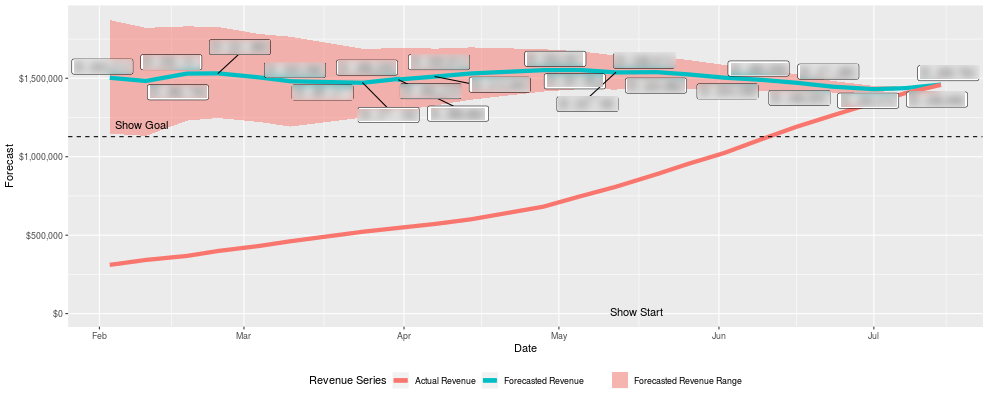

**TL;DR—I built websites as a teenager, rediscovered that I loved coding on a
whim, spent many hours taking online courses, built an election model like
FiveThirtyEight, and then figured out a Bayesian sales model.**

## How I started

Three years ago, on a whim, I decided to get a DataCamp subscription and learn
R.

It wasn't my first experience with coding - I had designed a few websites
through my teenage years and university, most using HTML and CSS. I had even
dabbled in JavaScript, Java and Python before, but never in any serious way.
Mostly, it had been small functions to support the websites that I was building,
or little extensions for Blender, or Maya, or video game mods.

I had also made much use of my relatively limited coding ability at every job
I'd ever worked at. **I'd always found that coding gave me a leg up over other
people in similar positions to those that I held**.

I didn't just have to use the WYSIWYG editors to create marketing emails. I
could _redesign the templates_. I didn't have to go to our web designer to make
that WordPress page edit. I could just _lay it out myself_.

In other words, I had always been interested in and known the power of code, so
my decision didn't come totally out of the blue. **But at the time, I didn't
realize how transformative it would be.**

## Why R?

I decided to learn R for two reasons: first, because the job I have involves a
lot of data processing, and second, I became obsessed with
[FiveThirtyEight's election model of the 2016 presidential election](https://projects.fivethirtyeight.com/2016-election-forecast/)
and specifically their Bayesian approach.

https://twitter.com/FiveThirtyEight/status/1030490731385745410

For those who don't know,
[Bayes theorem](https://en.wikipedia.org/wiki/Bayes%27_theorem) is all about the
probability of an event occurring based on our prior knowledge of related
conditions. For example, if I know that
[hockey players are usually born in January and February](https://www.nhl.com/mapleleafs/news/the-importance-of-a-players-birthday/c-536337)
and that they often have
[very dedicated parents](https://nationalpost.com/news/canada/canadian-roulette-why-some-parents-devote-everything-for-the-infinitesimal-chance-of-getting-their-kid-into-the-nhl),
I can assess someone's probability of making the NHL based on those conditions.

At work, one of the big projects that I work on is a sales tracker that uses
historical data to predict future sales based on current trends. It was also one
of the major reports that people relied upon across the company to make business
decisions.

The problem was that the whole tracker was in an Excel spreadsheet! It was a
massive amount of work _every day_ to update each row of the sheet for all of
the products and data points that we were tracking. I knew that this was
precisely the kind of project that called for a custom-built piece of software.

Meanwhile, I followed FiveThirtyEight's data every day. I've always been
fascinated by math and complex models, and I wanted to understand how their 2016
forecast worked. It's not that I thought that their 2016 election model was
_wrong_ as many people do, I just wanted to know how they had constructed it to
be so accurate. (Anything that can happen 30% of the time still has an excellent
chance of actually happening.) I was intrigued by the simplicity of Bayes'
theorem and how, in lots of ways, it's only with the advent of widespread high
powered computing that we're able to see just how powerful an idea it is.

So I committed to learning R because I really wanted to know how it worked!

**I ended up doing all of DataCamp's Data Scientist career track in about a
month** and several other courses they offer. It was hard work, and a lot of
long hours trying to remember which function did what and how to get the data to
mutate in the right way.

**Acknowledgement:** I'm incredibly lucky that one of the enormous privileges
that I have is the time and freedom to devote to my ongoing education. I have no
kids, and relatively few outside obligations to pull me away from learning. But
I also have the drive to finish what I started. It meant giving up reading,
video games, watching Netflix, and a lot of fun things. But it was worth it.

https://twitter.com/EmmaBostian/status/1270999138839207936?s=20

## My First Model

One of the first projects that I worked on was a predictive model for the
[British Columbia provincial election in 2017](https://en.wikipedia.org/wiki/2017_British_Columbia_general_election).
That let me do a deep dive into R and Stan, and figure out how Nate Silver's
models work.

It was tough! I quickly learned that the most difficult thing about constructing
a model is getting clean data. Luckily, most voting data is public, but it still
meant downloading dozens of Excel files, importing them into RStudio, and
standardizing a workable dataset.

I was helped a TON by the fantastic G. Elliot Morris and
[the Economist's open source election model](https://github.com/TheEconomist/us-potus-model).
Huge shout out to awesome folks at big companies who make open source!

https://twitter.com/gelliottmorris/status/1271026014328586240?s=20

Ultimately, what stuck with me was **how important it is to be able to
communicate complexity**. As I got further and further into the weeds of
building a predictive model, I saw that in many ways, FiveThirtyEight's
brilliance is in how they simplify p-values, and r2, and MCMC chains
into a universal language that's accessible to anyone. It would be SO easy for
Nate to have kept his blog to a very nerdy, wonky corner of the internet for
people who understood the jargon. But instead, he was able to grow it into a
media company that has had enormous influence over how polling, data, and
numbers are portrayed in the media.

On election night, I was a bit nervous. I had this model open on my laptop which
was predicting that the B.C. Liberals would win another term in government. Even
though I hadn't shared my work with anyone, it felt like a lot of pressure to be
right!

My final run of the model gave the Liberals a 68% chance of winning a majority
of seats, with an average of 46 seats, meaning that they would win a 5th
straight term in government.

[And at first, I was kinda right?](https://www.cbc.ca/news/canada/british-columbia/bc-election-2017-results-1.4107582)

[Or maybe, I wasn't totally wrong?](https://www.cbc.ca/news/canada/british-columbia/horgan-government-guichon-2017-1.4185204)

In the end, the Liberals did win a majority of seats... by 43-41... but they
theoretically "lost" the election. The joys of parliamentary democracy.

## Bringing It Back

That's when I decided to apply what I was learning to my work.

I took everything that was happening in the sales tracker Excel spreadsheets,
and turned it into a MASSIVE R project. When I say massive, I mean that I didn't
understand the power of a for loop, and I copied and pasted code for each
separate product. The entire codebase for that one tracker was over 11,000 lines
long. It worked, and it was game-changing for my company in many ways, but man -
it was ugly. 😅

**Side note**: when I came back to that code to set it up for the next fiscal
year after learning WAY more, I was able to refactor it in to - get this -
**1,827 lines of code.**

In any case, I knew that just tracking the data wasn't enough. Sure, I was able
to connect to the SQL database, query the data, mutate and transform it, and
even present it beautifully in a web application using ggplot2 and Shiny. But my
holy grail was a Bayesian predictive model of future sales. I knew it was
possible because I'd just finished this election model using the same
techniques. Still, it wasn't immediately apparent how to build a similar model
for this new purpose.

In the election model, I had collected and standardized a dataset of historical
voting in every election in every riding in British Columbia since 1983, as well
as current and past polling data, economic indicators and a few other relevant
data points. Everything combined to predict a single event: the outcome of the
2017 election.

But sales data is very different, and the prediction goal is very different.
Instead of having data points representing the same event (i.e., an election) at
set points in time going back decades, sales data is millions of rows of orders
that happen every day and continue to happen every day. What you're trying to
predict is where sales will "end" at a given future day. It's as if we had no
polling, and people never stopped voting in elections, and every day we knew how
people had voted, but at periodic points, we decided it was time to have an
outcome.

It sounds similar, and that difference may not seem huge if you've never built a
predictive model, but trust me, it's massive.

## Sometimes You Just Have to Step Away

I tried different approaches. I Googled a million things. I read a ton of blog
posts. I combed through as many open-source predictive R models as I could find
on GitHub. I bought a gigantic book called _Doing Bayesian Data Analysis_. Then,
after a month of searching without coming up with anything, the answer just fell
into my head while I was doing the dishes.

Solving the problem is a topic for another post, but it taught me the value of
**stepping away from the problem for a little while**. You can get so deep into
the weeds of how you think something _should_ work, that you lose sight of the
big picture.

In the years since I so often find that when I get stuck with a problem and
Google can't help, the best thing to do is to leave it alone for a little while
and work on something else. Usually, this happens because the problem revolves
around something more philosophical than Stack Overflow handles gracefully.
Later, away from the computer, stepping through my thought process, I often find
the point where I started getting too deep and discover that there is a simpler,
cleaner, faster solution.

So I built the model. And it was highly accurate! It predicted nearly 80% of
final sales results within an acceptably tight range about 250 days prior.

For the first time, I felt the power of what I had learned. **I was able to
spend around 100 hours taking courses and practicing, and then build a Bayesian
model that could predict the future!**

From here, I turned my attention to presenting my tracker and its data to the
world, which led me to JavaScript, React, and the entire ecosystem of the modern
web! That will be the topic of part two, which is coming soon!
