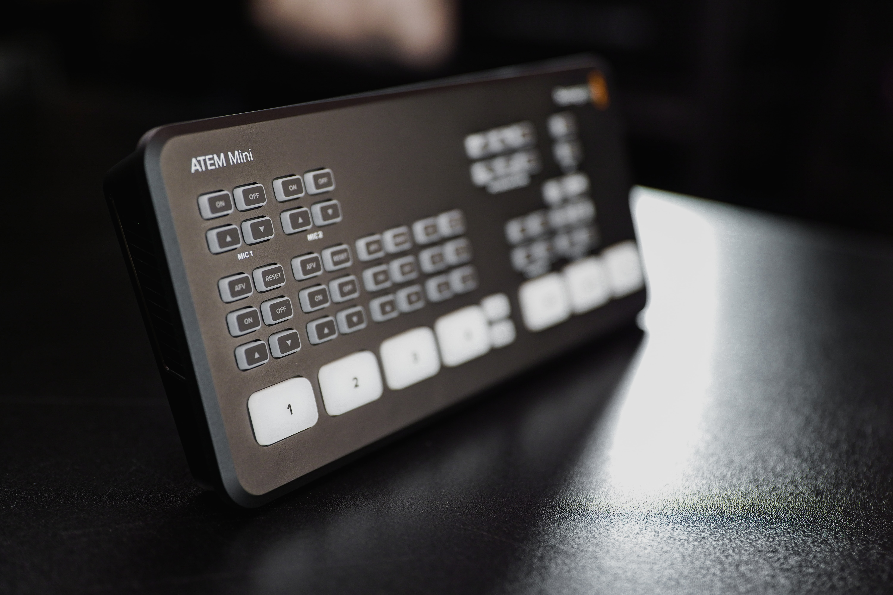
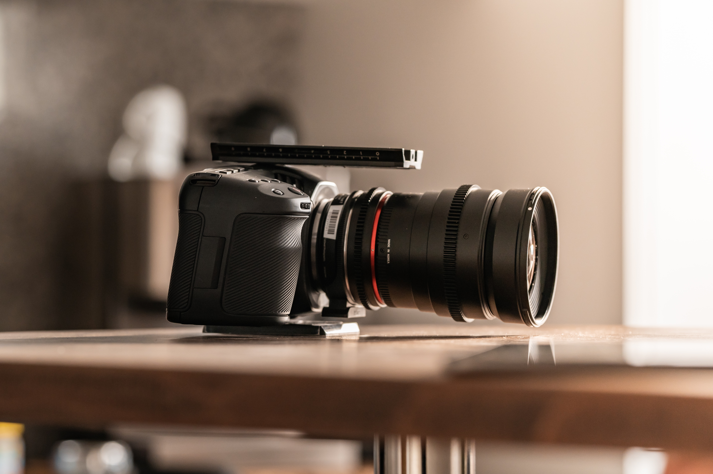

Lately, many people have been asking me how theatres can stream their
shows to ticket buyers and what equipment is needed to do this well.
To help these people (and myself), I've put together this list for reference.

Like so many people who work in the entertainment industry, over the past eight months,
I've worked on all aspects of a streaming production: in front of the camera as an actor,
directing actors for the camera, controlling the cameras themselves, and managing the delivery of
streaming or recorded content to patrons.

Streaming theatre productions is unique: for the most part, we're working in
spaces that have state-of-the-art lighting systems and audio equipment. This list is
intended for community or professional theatre companies that
are working in a space that already has that equipment.

Here are my recommendations for streaming equipment for theatre companies.

## Alternatives

You don't *need* to get any expensive equipment. If the
theatre company or group you're working with can only afford to use an iPhone to
record, then that will work perfectly! A newer iPhone's quality may be
better than a lot of the prosumer equipment out there.

For the first level up from a single stationary phone, I recommend
[checking out NDI](https://www.ndi.tv/tools/). With a tiny budget and no camera
operators, you could set up several phones running the
[NDI camera app](https://apps.apple.com/us/app/ndi-hx-camera/id1477266080?ls=1)
throughout a theatre. Then, using NDI's technical wizardry and a program like
[OBS](https://obsproject.com/), you can add all those cameras as sources and cut
between them to produce a pretty slick streaming production.

## Equipment

If you have a budget to spend, here are my equipment recommendations.

*Note: all prices are listed in CAD.*

### Production Switcher

Your most important piece of equipment, and to my mind, there is only
one option in this category:

**[BlackMagic ATEM Mini](https://www.amazon.ca/gp/product/B086R79PBC/ref=as_li_tl?ie=UTF8&camp=15121&creative=330641&creativeASIN=B086R79PBC&linkCode=as2&tag=readingly0f-20&linkId=38b7808e7aea7dba1fcbedc7ed04fd52)
production switcher - $435 for the base model - $1,030 for the Pro version**

I love the BlackMagic ATEM line and can't recommend it highly enough.

With this little gadget, you can connect up to four cameras at once via an HDMI cable,
along with two additional audio sources via 3.5mm jacks. It will even let you output
all of that to a monitor with a multiview layout that will make switching cameras and
graphics a breeze.

The built-in fade, cut, and wipe effects make it easy to create seamless presentations
on the fly, and the included ATEM Software Control will allow you to overlay graphics,
create cool picture-in-picture effects, add a green screen key, and more!

One thing that I've found useful is that it will also connect directly to any
computer via a USB-C cable and, once connected, it will register as a webcam. That means
 you can use the live output of the ATEM in Zoom, Google Hangouts, Youtube Live,
Facebook Live, Twitch, or any streaming platform.

I've even connected the audio output of an iMac running QLab. That means you can playback
show audio for the livestream through the ATEM and have a single operator run it all from one
computer!

### Cameras

Which camera to choose is dependent on your ultimate price range. No matter what the price,
however, you will want to get a camera that will work well in low light situations. Nothing
is worse than losing all the beautiful work your lighting designer has done by using a camera
that can't pick up the subtle differences in light. That means paying attention to the f-stop
of the camera lens (lower is better) is going to be very important!

Keeping in mind that you will want to have at least two and up to four of these cameras,
here are my recommendations:

**[BlackMagic Pocket Cinema Camera 4K](https://www.amazon.ca/Blackmagic-Design-Pocket-Cinema-Camera/dp/B07C5MFN1Z/ref=as_li_ss_tl?crid=2ZBCT6SZU5J3T&dchild=1&keywords=blackmagic+pocket+cinema+camera+4k&qid=1608160832&s=electronics&sprefix=blackmagic+pocket,electronics,231&sr=1-3&linkCode=ll1&tag=readingly0f-20&linkId=ba8fca99e94441b9fca22ebb3042e702&language=en_CA) - $2,059 for the body only + approximately $400 - $1,200 for a good lens**

The BlackMagic Pocket Cinema Camera is the most expensive camera I will recommend, but also the best. This camera
has phenomenal quality and shoots in 4K, or if you want to upgrade for about $1,000 more, 6K resolution. It also features a
dual gain ISO, which will boost your low light shots and make your lighting designer happy.

Shooting in 4K and streaming in 1080p will give you the unique ability
to have more "shots" within a single shot, just by cropping your image.

Amazingly, when paired with your BlackMagic ATEM Mini, you can control the camera from
the ATEM Software Control, including focus, zoom, ISO, and more. That means you could
have one super-human operator control the entire production!

Plus, this camera has an EF mount for its lenses, which means that if you have an old DSLR
sitting around like I do, it's lenses are likely compatible with this camera.

**[Canon XA40 Pro UHD 4K](https://www.amazon.ca/gp/product/B07QH3GKCL/ref=as_li_tl?ie=UTF8&camp=15121&creative=330641&creativeASIN=B07QH3GKCL&linkCode=as2&tag=readingly0f-20&linkId=87d40caa79712afa840c7346adb440aa) - $1,999**

If you anticipate that you will need active camera operators or have the budget available,
this is an excellent professional camcorder.

**[Sony Alpha A6400 Mirrorless Camera](https://www.amazon.ca/gp/product/B07MV3P7M8/ref=as_li_tl?ie=UTF8&camp=15121&creative=330641&creativeASIN=B07MV3P7M8&linkCode=as2&tag=readingly0f-20&linkId=ff29229fc9d8444e2839e063ef8a1d74) - $1,348 for the body only + approximately $400 for a reasonably priced lens**

Paired with a low f-stop lens in the 1.4-2.4 range, this is a perfect camera for streaming
that won't require too much camera operation.

You will get a crisp, clear picture in 4K with fantastic auto-focus capability. You can also
connect a microphone via the built-in mic jack and use the 180-degree tilting LCD screen
to monitor your video. Most importantly, this camera has a "clean" HDMI output, which means
that it will send a live signal without any of the onscreen info displayed on the LCD screen.

**[Panasonic HC-V770K HD Camera](https://www.amazon.ca/gp/product/B00RBG5J02/ref=as_li_tl?ie=UTF8&camp=15121&creative=330641&creativeASIN=B00RBG5J02&linkCode=as2&tag=readingly0f-20&linkId=74a1ad088bb7d2565d41c21cce2eaade) - $700**

The Panasonic HC-V770K is a great little camcorder. The lens is perfect for shooting in low light at a wide-angle,
but you will want to be careful not to zoom in too far as it will go up to an unsuitable f4.08
when fully zoomed in.

**[Zoom Q2N](https://www.amazon.ca/gp/product/B07VGZXCZ3/ref=as_li_tl?ie=UTF8&camp=15121&creative=330641&creativeASIN=B07VGZXCZ3&linkCode=as2&tag=readingly0f-20&linkId=a393a888926be2033b809aa234ff0b1c) - $299**

At the low end, these Zoom Q2N cameras perform decently well in medium to high light situations.
However, I have found that they are quite grainy in very low light and even in the black areas
of a well-lit shot. But, if you only have a limited budget, they are a great little camera with
fantastic audio for the price.

### Audio

If you are shooting in a traditional theatre environment, you will likely
have a lot of this equipment already. Most of your existing microphones should be compatible
with your new streaming equipment by connecting to the ATEM Mini via a 3.5mm jack.

I would recommend giving actors lavalier microphones or making use of area mics. If you
need to pick up some of this equipment, I recommend:

**[Rode Wireless Go Transmitter and Receiver](https://www.amazon.ca/Rode-Wireless-GO-Microphone-System/dp/B07QGGBNMN/ref=as_li_ss_tl?dchild=1&keywords=rode+lavalier&qid=1608163476&s=electronics&sr=1-3&linkCode=ll1&tag=readingly0f-20&linkId=3021a15a9dd5af3335deb9f3abc756e6&language=en_CA) - $280**

This transmitter and receiver pair is fantastic for short to medium range operation and
allows you to clip in any lavalier or headset microphone. It also features a rechargeable battery
with up to 7 hours of operation.

**[Rode smartLav+](https://www.amazon.ca/Rode-smartLav-Lavalier-Microphone-Smartphones/dp/B00EO4A7L0/ref=as_li_ss_tl?_encoding=UTF8&pd_rd_i=B00EO4A7L0&pd_rd_r=ee73f014-df38-43b9-b5e8-1aa94b8d5c2d&pd_rd_w=m3Rgz&pd_rd_wg=AsHwk&pf_rd_p=42339929-297e-4141-b7b2-fe55db70f4b7&pf_rd_r=HTFDA335B8V4ZQFK2H89&psc=1&refRID=HTFDA335B8V4ZQFK2H89&linkCode=ll1&tag=readingly0f-20&linkId=0e36eb9dcf1c053c357483efa6866398&language=en_CA) - $109**

The Rode smartLav+ is a high-quality omnidirectional mic with excellent sound when connected to
the Rode packs above or to a smartphone.

Note that this system will not work if you want to use it for a full-scale production with many actors
on stage. There are better and optimized systems for that.

### Accessories

There are a few necessary accessories to pick up, including tripods, HDMI range extenders, and miscellaneous
cables.

**[Velbon Videomate](https://www.amazon.ca/Velbon-Videomate-Aluminum-6-61lbs-Capacity/dp/B009D0ZJDQ/ref=as_li_ss_tl?dchild=1&keywords=velbon+videomate&qid=1608165230&sr=8-1&linkCode=ll1&tag=readingly0f-20&linkId=0a15e4f9e8a556aa0dc12c0de77cf161&language=en_CA) - $197**

I've been using my Velbon tripod for over a decade now. I've lugged it up mountains
and through forests, and aside from some small wear and tear, it's still going strong.

**[HDMI Range Extender](https://www.amazon.ca/dp/B06XPCHXS9/ref=as_li_ss_tl?ie=UTF8&linkCode=ll1&tag=readingly0f-20&linkId=8485200f4001c0bee70437ff553d05da&language=en_CA) - $49**

These little boxes combined with a [CAT 6 ethernet cable](https://www.amazon.ca/Ethernet-Higher-Bandwidth-Internet-Network/dp/B07HRL9CDG/ref=as_li_ss_tl?ie=UTF8&linkCode=ll1&tag=readingly0f-20&linkId=5975b97993531d8cc01a05a608008c87&language=en_CA) ($25 CAD) will let you get your cameras right up
close to the action while allowing your production switcher and control to be in a booth up to 200 ft away.

**[HDMI Cables](https://www.amazon.ca/Rankie-Cable-Supports-Ethernet-Return/dp/B01KRKO4MM/ref=as_li_ss_tl?_encoding=UTF8&pd_rd_i=B01KRKO4MM&pd_rd_r=43c5c6e4-975e-4781-af76-c09405d86847&pd_rd_w=KMaXT&pd_rd_wg=uwLPV&pf_rd_p=3885b243-7797-4c4b-b0ae-97ca9ec36283&pf_rd_r=FKK2JQXZCY3WP4AJ35WW&psc=1&refRID=FKK2JQXZCY3WP4AJ35WW&linkCode=ll1&tag=readingly0f-20&linkId=7e2d47bbcca96d9f515a32ff66ad3d4a&language=en_CA) - $10 - $25**

Depending on which cameras you decide to use, you will need an HDMI cable to run from the camera
into your range extender. Note that there is a difference between **Mini** HDMI and **Micro** HDMI!

**[HDMI Splitter 1 in 4 Out](https://www.amazon.ca/Splitter-Outputs-Support-Duplicated-Monitors/dp/B081H2BGMV/ref=as_li_ss_tl?_encoding=UTF8&pd_rd_i=B081H2BGMV&pd_rd_r=2430aca4-758d-4770-b418-4fd94a6f249a&pd_rd_w=FNvgB&pd_rd_wg=2YhwU&pf_rd_p=3885b243-7797-4c4b-b0ae-97ca9ec36283&pf_rd_r=QA78CEXNKBAWNZ17BSD9&psc=1&refRID=QA78CEXNKBAWNZ17BSD9&linkCode=ll1&tag=readingly0f-20&linkId=e27f5e11500bdb17ce8d00dde5ec1020&language=en_CA) - $22**

If you want to allow multiple monitors to watch the live multiview output from your ATEM (for example,
for a stage manager and a production table), then one of these little boxes will do the trick.

## Conclusion

When it comes to livestreaming your theatre production, having the right equipment for streaming is essential.
With a combination of the recommendations above, you will be able to produce a beautiful,
fully-realized livestream of your production for **as little as $1,000**, or the incredible
multi-camera setup of your dreams for as much as $15,000.

And, of course, the sky is the limit. If you have an even larger budget to spend, there are higher-end
cameras, larger production switchers, and much more to bring an even more professional look and feel to your
productions. But you would be amazed at the quality achievable with just a couple iPhones and
some creativity.

I can't wait to see what you create!