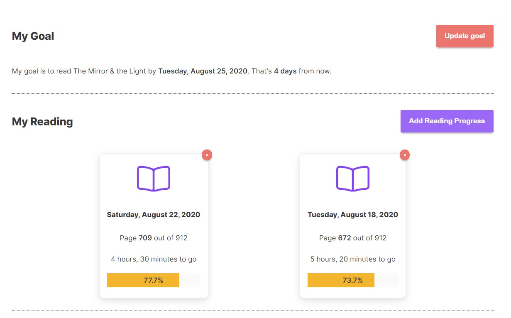

### The Idea

Readingly is a reading tracker application using the Google Books API. It helps
users meet their reading goals by providing personalized recommendations of how
much time to invest in their current book.

I've always been dissatisfied with the existing reading tracking tools, like
Goodreads. Mainly, I've always felt like they are too focussed on social
features when what I want is a smart tracker that will encourage me to read more
and discover new books. When I was brainstorming new portfolio projects, this
was the top of my list.



### The Tech

I used NextJS to develop the front end of the site, with Apollo Client for
caching and fetching data. The API uses Apollo Server, Express, and Sequelize on
top of a PostgreSQL database.

NextJS was my first choice for a front end framework for this project because of
its opinionated approach to React projects, its SEO and speed advantages, and
its new ability to support truly dynamic URLs.

I also decided to use Typescript on the front end after working in Java for a
few months. I now understand how type safety speeds up my development process by
a considerable amount over the long term.


On the backend, I decided to use an ORM to interact with the database since a) I
have only ever built projects using knex or SQL queries, and b) I wanted to
write the application with migrations, seeding data, and flexibility through the
development process. Sequelize was an excellent fit for those requirements, and
I was pleasantly surprised by how it let me work quickly and confidently on
everything required of the database.

I chose to develop with an Apollo Server GraphQL API on top of that because I
knew that a big part of the application would be combing data from sources like
the Google Books API, and I had never written a full GraphQL API from scratch.

Overall, I love how quickly these technologies let me work and how well they
integrate with each other into a unified whole.

### The Best Part

My favourite part of working on the app was expanding my knowledge of testing
practices while working towards having high test coverage for the whole
application.

For example, an area that I had never really worked through before was proper
integration testing. For the most part, this was a pretty straightforward
process of querying the API and ensuring that it returned expected values from
actual requests. But I quickly ran into the problem of how to test the API with
cookie-based authentication. There are many resources out there on how to test
an API with JWT based authentication. Surprisingly, there was very little about
how to do an integration test with a cookie!

Since I had decided to use cookie-based authentication for the
[security benefits](https://hasura.io/blog/best-practices-of-using-jwt-with-graphql/#jwt_security),
I needed to figure out this issue; otherwise, my tests would not be valid
integration tests.

Eventually, after looking through the response object returned by my login
resolver, I realized that with a little work, I could grab the cookie and attach
it as a header to subsequent requests.

Here's what I added to my tests/api script:

```js
import axios from "axios";

// Custom axios client for test requests
const api = axios.create({
  withCredentials: true,
  headers: {
    "Content-Type": "application/json",
  },
  adapter: require("axios/lib/adapters/http"),
});

// Helper utility to create better error messages and attach cookies
api.interceptors.response.use(
  function onSuccess(response) {
    return {
      data: getData(response),
      cookie: getCookies(response),
      response: response,
    };
  },
  function onError(result) {
    throw new Error(
      `${result.response.status}: ${JSON.stringify(
        result.response.data.errors[0].message
      )}`
    );
  }
);

// Function to get cookies off of the response object
const getCookies = res => {
  if (!res.headers["set-cookie"]) return null;
  const cookies = res.headers["set-cookie"][0]
    .split(",")
    .map(item => item.split(";")[0]);
  return cookies[0];
};
```
