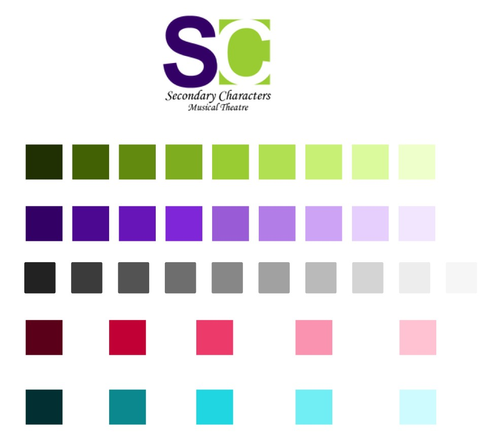

### The Idea

In June 2019, I was asked by Secondary Characters Musical Theatre to redevelop
and redesign their company website. They had been struggling with their Weebly
website and keeping it maintained with minimal tech knowledge. The site needed
to solve that problem with a straightforward interface for staff to update.

### The Tech

I used Gatsby to develop the frontend of the site and integrated
[NetlifyCMS](https://www.netlifycms.org/) on the back end for the CMS. It was an
ideal solution for this project because it allowed me to create a content model
for the site within Gatsby and reflect that accurately within the CMS.

I also looked into other CMS solutions, including a headless WordPress, Sanity,
and others. But ultimately, I opted for NetlifyCMS for the direct control and
customization that it gave me as a developer and the straightforward tools for
maintaining the site for the staff. It also allowed me to reduce their hosting
costs to zero. <span aria-label="Grinning face with smiling eyes">😄</span>

Additionally, after our design meetings, I knew that the staff's central goal
was to feature beautiful, high-resolution images of current and past shows.
Gatsby is perfect for this: it's server-side rendering, and progressive image
enhancement, means that users with any connection speed can enjoy the browsing
the site with super-fast load times.

### The Best Part

My favourite part of developing this site was to flex my design skills. Not only
was this an update of Secondary Characters' website, but it was also **a total
visual branding overhaul for the company**.



While the company had given me the freedom to overhaul their brand colours
(<span aria-label="Exploding head">🤯</span>), I wanted to try to make it work.
So I pulled the colours out from the existing logo (top of the picture above)
and then laid out a full palette by adjusting HSL values. Working this way meant
that I was able to keep the existing logo as part of the visual design to
maintain consistency, while also adding a bit of playfulness by making use of
lighter colours.

I also followed Adam Wathan and Steve Schoger's
[advice](https://refactoringui.com/) to define all of my design systems in
advance. That meant establishing everything from font sizes to spacing within
Figma, even before I began to create the site. Luckily, styled-components makes
it very easy to build those styles into the layout using Global Styles.

```js
const secondaryCharactersTheme = {
  // ... more styles here
  fontSize: {
    smallPrint: "11px",
    information: "14px",
    reading: "18px",
    emphasis: "24px",
    highLevel: "29px",
    subHeading: "36px",
    title: "48px",
    display: "64px",
    banner: "68px",
  },
  spacing: {
      extraExtraSmall: "4px",
      extraSmall: "8px",
      small: "12px",
      base: "16px",
      medium: "24px"
      mediumLarge: "32px",
      large: "48px",
      extraLarge: "96px",
      extraExtraLarge: "128px",
      quarterPage: "192px",
      thirdPage: "256px",
      halfPage: "384px",
      twoThirdPage: "512px",
      threeQuarterPage: "640px",
      page: "768px"
  }
};
```

All of this work paid off! It sped up my development by allowing me to focus on
building components and pages, rather than fiddling with spacing values and font
sizes to get the right look.
